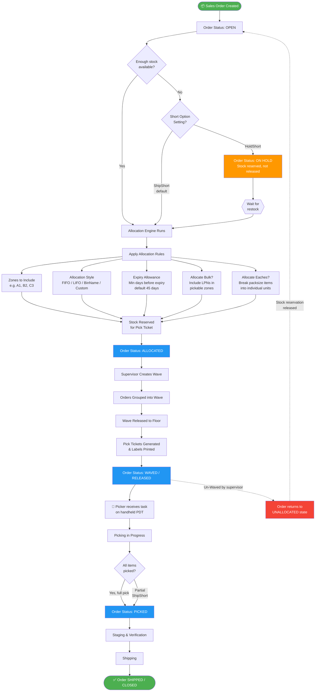

# P4 Warehouse — Allocation Process Flowchart

## Configuration Reference

| Setting | Location | Default | Options |
|---------|----------|---------|---------|
| Allocation Style | Setup → System Config → Fulfillment → Allocation | FIFO | FIFO, LIFO, BinName, Custom |
| Short Option | Setup → System Config → Fulfillment → Allocation | ShipShort | ShipShort, HoldShort |
| Zones to Include | Setup → System Config → Fulfillment → Allocation | All zones | Comma-separated zone codes |
| Allocate Bulk | Setup → System Config → Fulfillment → Allocation | No | Yes / No |
| Expiry Allowance | Setup → System Config → Fulfillment → Allocation | 45 days | Any number (overridden at customer level) |
| Allocate Eaches | Setup → System Config → Fulfillment → Allocation | Yes | Yes / No |

> **Note:** If an order is Un-Waved after release, it returns to **Unallocated** state — all stock reservations are released and inventory becomes available to other orders.
